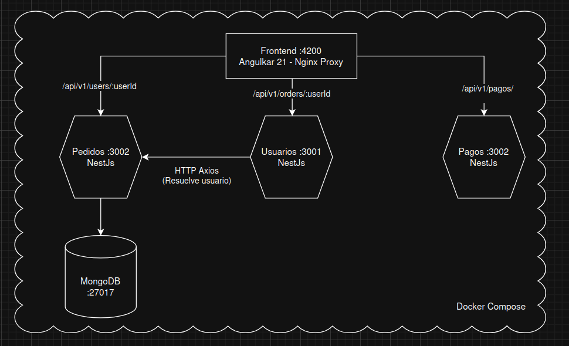
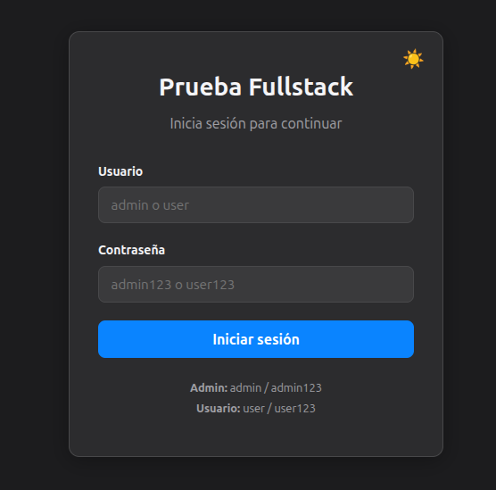
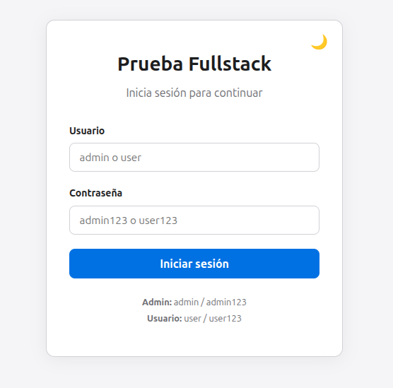
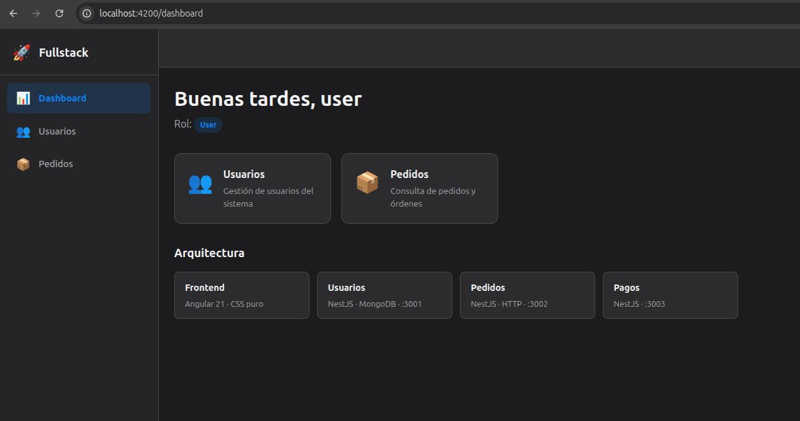
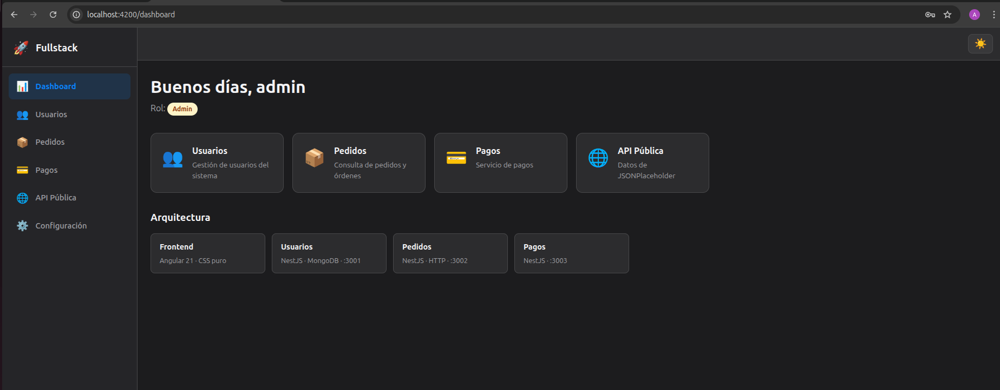
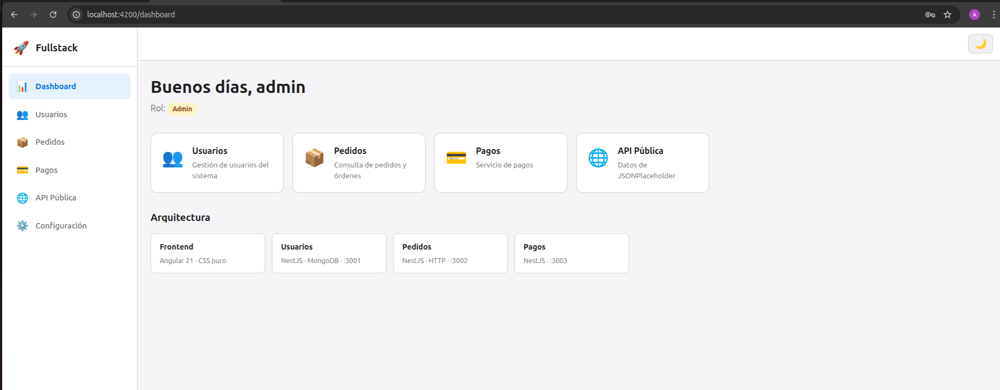
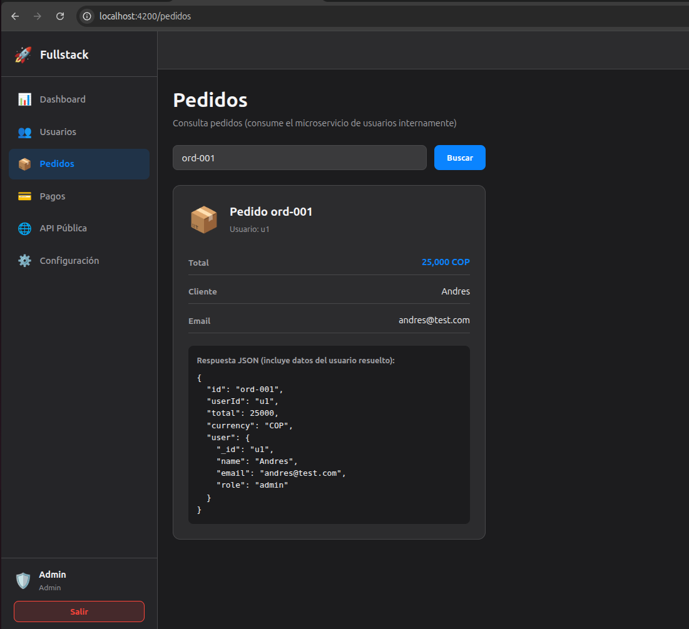

# Fullstack Microservices Platform

Implementación de una arquitectura de microservicios escalable y productiva, lista para ejecutar con un solo comando. Diseñada para demostrar separación de responsabilidades, comunicación inter-servicio, y despliegue containerizado eficiente.

```bash
docker compose up --build
```

## Arquitectura


## Decisiones Técnicas

| Decisión | Razón |
|---|---|
| **Microservicios independientes** | Cada servicio tiene su propio Dockerfile, dependencias y ciclo de vida. Permite escalar, desplegar y mantener cada pieza de forma aislada. |
| **Nginx como reverse proxy** | El frontend en producción rutea las llamadas API a través de Nginx, eliminando problemas de CORS y centralizando el punto de entrada. |
| **Multi-stage Docker builds** | Reduce el tamaño de las imágenes de producción al separar la fase de compilación de la de ejecución. Solo se copian los artefactos necesarios. |
| **Angular con Signals y Standalone** | Adopción de las APIs más recientes de Angular (v21): signals para reactividad sin RxJS innecesario, standalone components para eliminar NgModules, y lazy loading por ruta. |
| **NestJS con ValidationPipe + Helmet** | Validación automática de DTOs en cada request y headers de seguridad HTTP desde el arranque. |
| **Comunicación HTTP entre servicios** | Pedidos resuelve datos del usuario llamando al servicio de Usuarios internamente, demostrando composición de microservicios. |

## Stack

**Frontend:** Angular 21 · TypeScript · Nginx · CSS Variables (dark/light theme)

**Backend:** NestJS 11 · Mongoose · Axios · class-validator · Helmet

**Infraestructura:** Docker Compose · MongoDB 6 · Node 20 Alpine

## Servicios

### Usuarios (`:3001`)
CRUD de usuarios con persistencia en MongoDB. Seed data incluida para desarrollo.

| Método | Endpoint | Descripción |
|--------|----------|-------------|
| GET | `/api/v1/users/:id` | Obtener usuario por ID |
| GET | `/api/v1/health` | Health check |
| GET | `/api/v1/status` | Estado del servicio |

### Pedidos (`:3002`)
Gestión de pedidos con resolución de datos de usuario via comunicación inter-servicio.

| Método | Endpoint | Descripción |
|--------|----------|-------------|
| GET | `/api/v1/orders/:id` | Obtener pedido (incluye datos del usuario resuelto) |
| GET | `/api/v1/health` | Health check |

### Pagos (`:3003`)
Servicio de pagos con health check y monitoreo.

| Método | Endpoint | Descripción |
|--------|----------|-------------|
| GET | `/api/v1/health` | Health check |
| GET | `/api/v1/status` | Estado del servicio |

##  API Pública Utilizada

Endpoint utilizado:
GET https://jsonplaceholder.typicode.com/posts

La información se muestra en la vista "API Pública" del frontend.


## Quick Start

### Con Docker (recomendado)

```bash
# Levantar toda la plataforma
docker compose up --build

# Frontend:  http://localhost:4200
# Usuarios:  http://localhost:3001/api/v1
# Pedidos:   http://localhost:3002/api/v1
# Pagos:     http://localhost:3003/api/v1
```

### Desarrollo local (sin Docker)

```bash
# Terminal 1 - MongoDB
docker run -d -p 27017:27017 --name mongo mongo:6

# Terminal 2 - Usuarios
cd usuarios && npm install && npm run start:dev

# Terminal 3 - Pedidos
cd pedidos && npm install && npm run start:dev

# Terminal 4 - Pagos
cd pagos && npm install && npm run start:dev

# Terminal 5 - Frontend
cd frontend && npm install && npm start
```

## Frontend

Aplicación Angular con sistema de autenticación basado en roles:

| Usuario | Contraseña | Rol | Acceso |
|---------|-----------|-----|--------|
| `admin` | `admin123` | Admin | Dashboard, Usuarios, Pedidos, Pagos, API Pública, Configuración |
| `user` | `user123` | User | Dashboard, Usuarios, Pedidos |

## 🖼 Capturas de Pantalla

### Login


### Login Light


### Rol Usuario (3 items)


### Rol Admin (5 items)


### Rol Admin Light


### Orders consumiendo Backend



**Características:**
- Tema claro/oscuro con persistencia en localStorage
- Sidebar responsive con navegación dinámica por rol
- Lazy loading en todas las rutas
- Guards de autenticación y autorización por rol

## Que sigue (MAPROAD)?

- [ ] JWT authentication con endpoint de login en backend
- [ ] Persistencia real en servicio de Pedidos (MongoDB)
- [ ] Lógica de procesamiento en servicio de Pagos
- [ ] Comunicación event-driven con RabbitMQ/Redis
- [ ] Tests unitarios y e2e
- [ ] CI/CD pipeline
- [ ] API Gateway centralizado